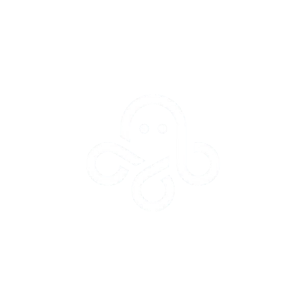

<a name="readme-top"></a>

<div align="center">
  
  <h1>OctoLinux</h1>
  <p><strong>An experimental desktop Linux distribution and operating-system design prototype.</strong></p>
  <p>
    <a href="https://github.com/Lollollolmymy/Octo-Linux/releases">Download a Pre-Alpha ISO</a>
    ·
    <a href="https://github.com/Lollollolmymy/Octo-Linux/issues/new">Report a Problem</a>
    ·
    <a href="https://github.com/Lollollolmymy/Octo-Linux/issues">View Issues</a>
  </p>
  <p>
    <a href="https://github.com/Lollollolmymy/Octo-Linux/releases"></a>
    <a href="https://github.com/Lollollolmymy/Octo-Linux/issues"></a>
    <a href="https://github.com/Lollollolmymy/Octo-Linux/stargazers"></a>
  </p>
</div>

---

> [!CAUTION]
> **OctoLinux is pre-alpha proof-of-concept software.** Most planned features are unfinished, included features may not work reliably, and the installer can erase a selected disk. Use the ISO only in a virtual machine or on disposable test hardware. Do not use it as a daily operating system or on a machine containing important data.

<details>
  <summary>Table of Contents</summary>
  <ol>
    <li><a href="#about">About</a></li>
    <li><a href="#project-status">Project Status</a></li>
    <li><a href="#current-image">Current Image</a></li>
    <li><a href="#architecture">Architecture</a></li>
    <li><a href="#testing">Testing the ISO</a></li>
    <li><a href="#building">Building</a></li>
    <li><a href="#project-structure">Project Structure</a></li>
    <li><a href="#contributing">Contributing</a></li>
    <li><a href="#upstream">Upstream and Attribution</a></li>
  </ol>
</details>

---

## <a name="about"></a> About

OctoLinux is an experiment in building a cohesive desktop operating system on top of the Linux kernel and the XBPS package ecosystem. The long-term design calls for an s6-managed system, Wayland, a custom wlroots compositor named OctoComp, and small cooperating desktop components.

The current ISO is a bootstrap image. It uses a customized Xfce desktop and LightDM while the original OctoLinux compositor, panel, dock, notification manager, keybind service, and launcher are developed.

OctoLinux is not a from-scratch kernel or a production distribution. It is currently a bootable design prototype for testing branding, live-media construction, desktop defaults, package selection, and installation flow.

<p align="right">(<a href="#readme-top">back to top</a>)</p>

---

## <a name="project-status"></a> Project Status

**Release stage: Pre-alpha / proof of concept**

| Area | Current state |
|---|---|
| Hybrid BIOS/UEFI ISO | Boots in tested virtual machines; hardware coverage is limited |
| Live desktop | Xfce reference environment; configuration is still being stabilized |
| Graphical login | LightDM is included; login behavior remains experimental |
| Guided installer | Creates partitions and a user, but needs substantially more safety testing |
| Desktop selection | Xfce, GNOME, KDE Plasma, and MATE are offered; non-Xfce paths are lightly tested |
| Networking and audio | Packages are included; integration is incomplete |
| Branding | OctoLinux assets are present; remaining upstream text or artwork should be reported |
| OctoComp | Planned; not yet the active compositor |
| Custom desktop services | Planned or early-stage; not ready |
| s6 integration | Architectural target; the live bootstrap still inherits upstream runit machinery |
| Real-hardware installation | Not recommended |

The downloadable ISO exists so the project structure and direction can be tested. A successful boot does not mean installation, updates, suspend, graphics acceleration, networking, Bluetooth, audio, printing, Flatpak, or alternate desktops work correctly.

<p align="right">(<a href="#readme-top">back to top</a>)</p>

---

## <a name="current-image"></a> Current Image

- Architecture: `x86_64`
- Package base: XBPS and glibc packages
- Live desktop: Xfce
- Display manager: LightDM
- Default terminal: Ghostty
- Shell: Zsh
- Graphics: Xorg reference session with Mesa
- Installer: OctoLinux guided installer and advanced manual path
- Guided filesystem: ext4
- Installed bootloader: GRUB for BIOS/UEFI

The live environment uses a temporary account. Installed systems do not copy it; the guided installer asks the person installing OctoLinux to create their own username and password.

### Planned Desktop Stack

| Component | Plan |
|---|---|
| OctoComp | C compositor/window manager built with wlroots |
| Panel | C top panel |
| Dock | C auto-hiding application dock |
| Notification manager | C desktop notification service |
| Keybind service | C global shortcut daemon |
| Application launcher | Rust and Slint |

<p align="right">(<a href="#readme-top">back to top</a>)</p>

---

## <a name="architecture"></a> Architecture

```text
UEFI / BIOS
    -> Linux kernel and live initramfs
    -> bootstrap service environment
    -> LightDM
    -> Xfce reference desktop
    -> OctoLinux installer and desktop configuration
```

The intended final desktop follows three communication rules:

1. Use standard Wayland protocols where possible.
2. Use D-Bus for system and desktop services.
3. Use custom IPC only for OctoComp-specific behavior.

The live-image generator is based on `void-mklive` because it provides the kernel, initramfs, SquashFS, live-root, BIOS, and UEFI plumbing needed by this prototype.

<p align="right">(<a href="#readme-top">back to top</a>)</p>

---

## <a name="testing"></a> Testing the ISO

Download the latest pre-release ISO from [GitHub Releases](https://github.com/Lollollolmymy/Octo-Linux/releases).

For VirtualBox:

1. Create a 64-bit Linux virtual machine.
2. Assign at least 4 GB RAM, 2 CPU cores, and a 20 GB virtual disk.
3. Enable EFI to test the UEFI path.
4. Attach the OctoLinux ISO as the optical disk.
5. Boot the live environment before attempting installation.

> [!WARNING]
> The guided installer erases the selected target disk after confirmation. Verify the selected device carefully. Virtual-machine testing is strongly recommended.

To write the ISO from macOS:

```sh
./tools/flash-usb-macos.sh dist/octolinux-stage0-x86_64.iso
```

<p align="right">(<a href="#readme-top">back to top</a>)</p>

---

## <a name="building"></a> Building

Requirements:

- At least 15 GiB of free workspace storage
- Docker or Podman on Linux
- Colima and Docker CLI on Apple Silicon macOS
- Network access to XBPS repositories

Fetch the upstream builder and apply the OctoLinux container patch:

```sh
./tools/fetch-void-mklive.sh
```

Build with Docker or Podman:

```sh
./tools/build-in-container.sh
```

Fast Apple Silicon build:

```sh
./tools/fast-build-macos.sh
```

Smaller release build:

```sh
OCTOLINUX_BUILD_MODE=release ./tools/build-in-container.sh
```

The generated image is written to:

```text
dist/octolinux-stage0-x86_64.iso
```

Generated ISOs, package caches, VM disks, and the fetched upstream checkout are deliberately excluded from Git. Release ISOs belong in GitHub Releases.

<p align="right">(<a href="#readme-top">back to top</a>)</p>

---

## <a name="project-structure"></a> Project Structure

```text
Octo-Linux/
├── Containerfile          # Reproducible Linux builder environment
├── hooks/
│   └── postsetup.sh       # Final live-root customization
├── overlay/
│   ├── etc/               # System, LightDM, shell, and desktop defaults
│   └── usr/               # Installer, assets, helpers, and tools
├── packages/
│   ├── base.txt           # Base package selection
│   └── desktop.txt        # Graphical package selection
├── patches/
│   └── void-mklive-container.patch
└── tools/
    ├── build-iso.sh
    ├── build-in-container.sh
    ├── fast-build-macos.sh
    ├── fetch-void-mklive.sh
    └── flash-usb-macos.sh
```

<p align="right">(<a href="#readme-top">back to top</a>)</p>

---

## <a name="contributing"></a> Contributing

Useful contributions include:

- Reproducing and documenting boot failures
- Testing different hypervisors
- Improving installer validation and recovery
- Removing remaining upstream branding from user-facing surfaces
- Making desktop defaults deterministic
- Packaging the planned OctoLinux components

Include the hypervisor or hardware, firmware mode, assigned storage and RAM, and relevant logs in bug reports.

<p align="right">(<a href="#readme-top">back to top</a>)</p>

---

## <a name="upstream"></a> Upstream and Attribution

OctoLinux currently consumes packages and live-image tooling from the Void Linux ecosystem. Void Linux and OctoLinux are separate projects; OctoLinux is not an official Void Linux flavor.

The upstream live-image tooling is fetched from [`void-linux/void-mklive`](https://github.com/void-linux/void-mklive) and patched locally for container-friendly image creation. See the upstream project for its copyright and license terms.

No stability, compatibility, or data-safety guarantees are made for this pre-alpha image.

<p align="right">(<a href="#readme-top">back to top</a>)</p>
